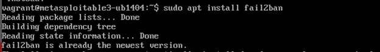
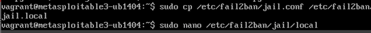
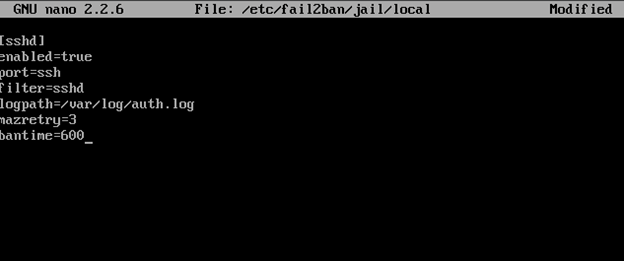
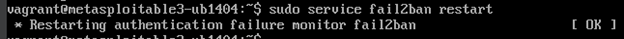
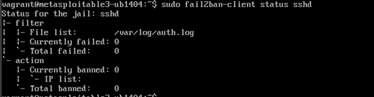
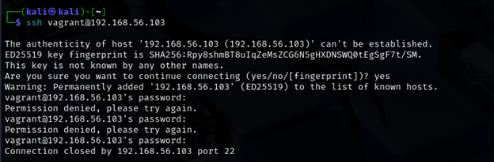

# Phase 3 – Defense Implementation Using Fail2Ban

## Environment Setup
- **Victim Machine**: Metasploitable3
- **Defense Tool**: Fail2Ban
- **Target Service**: SSH

---

## Step 1: Install Fail2Ban
```bash
sudo apt install fail2ban
```


---

## 🛠 Step 2: Copy & Edit Jail Configuration
```bash
sudo cp /etc/fail2ban/jail.conf /etc/fail2ban/jail.local
sudo nano /etc/fail2ban/jail.local
```


Modified section:
```
[sshd]
enabled=true
port=ssh
filter=sshd
logpath=/var/log/auth.log
maxretry=3
bantime=600
```


---

## Step 3: Restart Fail2Ban
```bash
sudo service fail2ban restart
```


---

## Step 4: Verify Fail2Ban is Active
```bash
sudo fail2ban-client status sshd
```
This confirms monitoring on `/var/log/auth.log` is active.


---

## Step 5: Test the Defense
From attacker machine:
```bash
ssh vagrant@192.168.56.103
```
- Entered wrong password 3 times
- Connection was forcefully closed


---

## Outcome
- Fail2Ban successfully detected and blocked brute-force login attempts on SSH.
- Confirmed system security improved with reduced exposure to repeated unauthorized login attempts.
